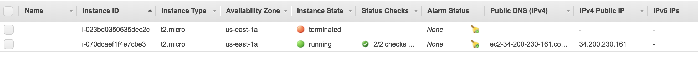

# Terraform-ec2-vpc

This Repo contains Terraform configuration files to launch an EC2 instance in a virtual private cloud on AWS

## Table of Contents

- [Requirements](#requirements)
- [Getting Started](#getting-started)

## Requirements
For the deployment to be succesfull, you need to do the following
- Create an AWS account. if you don't have an account. create one [here](https://aws.amazon.com/resources/create-account/)
- Create an IAM user with credentilas and enable programmatic access.
- Install terraform on your host machine.


## Getting Started
You need to ensure that all variables specific to your aws account such as AWS region are declared in vars.tf file as shown below
```
  variable "AWS_REGION" {
    default = "us-east-1"
  }
  variable "AMIS" {
    type = "map"
    default = {
      us-east-1 = "ami-07917569e2c4a2b6a"
      us-west-2 = "ami-03715f92274307130"
      eu-west-1 = "ami-0f9036df5dbe8d6ac"
    }
  }
```
Create ssh keys to login to the remote instance

```
ssh-keygen -f mykeys
```
This will create ssh keys inside the current directory 
Initialize terraform in the project repo
```
terraform init 
```
Run the config files

```
terraform apply 
```
Running the above commands should result in 
console result


ec2 instance deployed on aws


VPC with name main created


To terminate the instance and VPC environment

```
terraform destroy 
```
